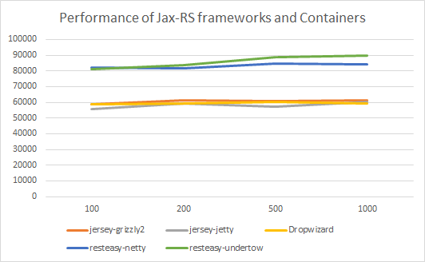

# Jax-RS-Performance-Comparison
Performance Comparison of Jax-RS implementations and embedded containers

[](https://drone.io/github.com/smallnest/Jax-RS-Performance-Comparison/latest)

[Gajotres](http://www.gajotres.net/best-available-java-restful-micro-frameworks/#author-box) have written an article: [Top 8 Java RESTful Micro Frameworks](http://www.gajotres.net/best-available-java-restful-micro-frameworks/). He listed 8 best light weight Java RESTful framework.
Personally, I perfer jax-rs implementations and micro frameworks for deploying applications as micro services and those micro services can be deployed in docker containers.

So I have test five Jax-RS implementations plus embedded containers despite business logics. The RESTful service is very simple and it only returns a "hello world" string. Remember,  tests don't contain any business logics even JSON libraries.
There are other articles to dicuss serialization framework. For example, [my test](http://colobu.com/2014/08/26/java-serializer-comparison/)

I have added more RESTful framework besides Jax-RS implementation, which contains:
* Spring-boot
* RESTEasy + Netty4
* Native Netty
* Vert.x
* Go


You can check the test result and the performancre chart.

### Compile applications
It is a multiple-module maven project.
You can run "mvn package" in parent directory to packge each module.
It generates a fat-jar in target directories of modules for each module.
It is easy.

### Test Environment
**Server**
AWS C3.2xlarge
- 8 cores (E5-2666 v3 @ 2.90GHz)
- memory: 16G (only allocate 4G for restful applications)

**Java**
1.8.0_51

**Test tool**
[wrk](https://github.com/wg/wrk)
the test cmd is like: `wrk -t16 -c1000 -d30s http://127.0.0.1:8080/rest/hello `.
I use 16 threads and 100/200/500/1000 connnections to test each case.

**Starting Server**
```
java -Xmx4g -Xms4g -jar jersey-grizzly2-1.0-SNAPSHOT.jar
java -Xmx4g -Xms4g -jar jersey-jetty-1.0-SNAPSHOT.jar
java -Xmx4g -Xms4g -jar dropwizard-1.0-SNAPSHOT.jar hello.yml 
java -Xmx4g -Xms4g -jar resteasy-netty-1.0-SNAPSHOT.jar 
java -Xmx4g -Xms4g -jar resteasy-undertow-1.0-SNAPSHOT.jar
java -Xmx4g -Xms4g -jar springboot-1.0-SNAPSHOT.jar
java -Xmx4g -Xms4g -jar resteasy-netty4-1.0-SNAPSHOT.jar 
java -Xmx4g -Xms4g -jar nativenetty-1.0-SNAPSHOT.jar
java -Xmx4g -Xms4g -jar vertx-1.0-SNAPSHOT.jar 
```

### Test Result

Test data is [here](TestData.md)



### Conclusion
It looks Resteasy is better than jersey whatever jersey uses grizzly2 or jetty container.

It is predictable that performance of dropwizard is same to jersey+jetty.

Resteasy is excellent in undertow and netty.

To my surprise is resteasy+undertow is a little better than resteasy+netty. Maybe they are all developed by JBoss and they have done some optimization.

I do not recommend you use spring boot in large projects because its performance and style.

Of course native netty is number one but my test has not contains a http router so maybe you can't say it is RESTful framework. But I like its perforamnce.

Performance of RESTEasy+netty4 is lower than what i expect. but RESTEasy+netty3 is very good.

~~One interesting framework is Vert.x. I like its functional programming style but its performance is not so good.~~


I have not monitored the CPU usage and memory usage. You can try it. 

### Update
* 2015/11/19 add native go, go-restful codes
